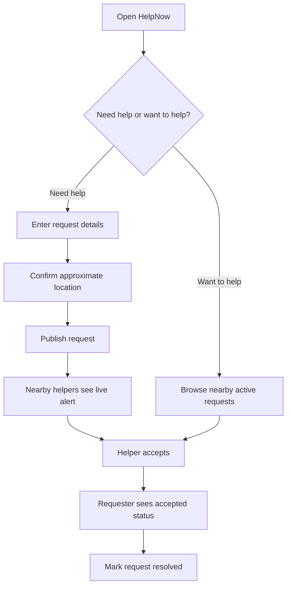

# User flow

```mermaid
flowchart TD
  A[Open HelpNow] --> B{Need help or want to help?}
  B -->|Need help| C[Enter request details]
  C --> D[Confirm approximate location]
  D --> E[Publish request]
  E --> F[Nearby helpers see live alert]
  F --> G[Helper accepts]
  G --> H[Requester sees accepted status]
  H --> I[Mark request resolved]
  B -->|Want to help| J[Browse nearby active requests]
  J --> G
```

The MVP uses a demo identity. The next milestone adds sign-in, contact sharing only after acceptance, and a feedback flow after resolution.
